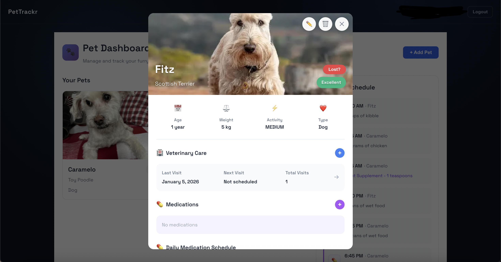
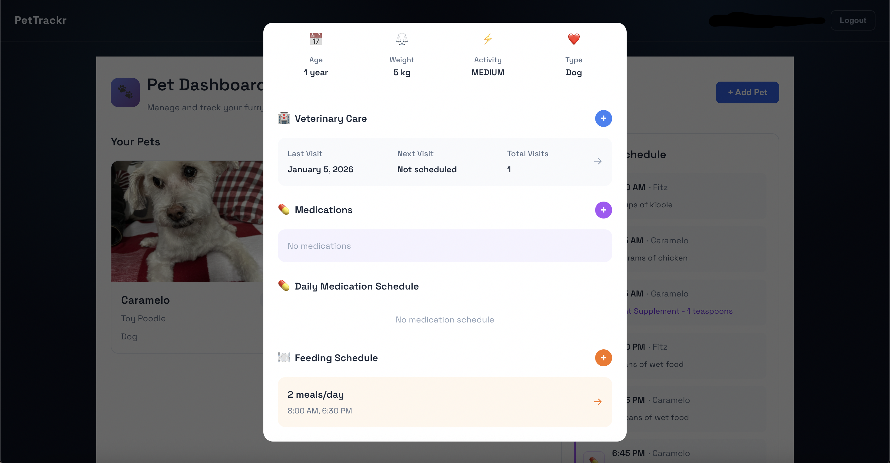
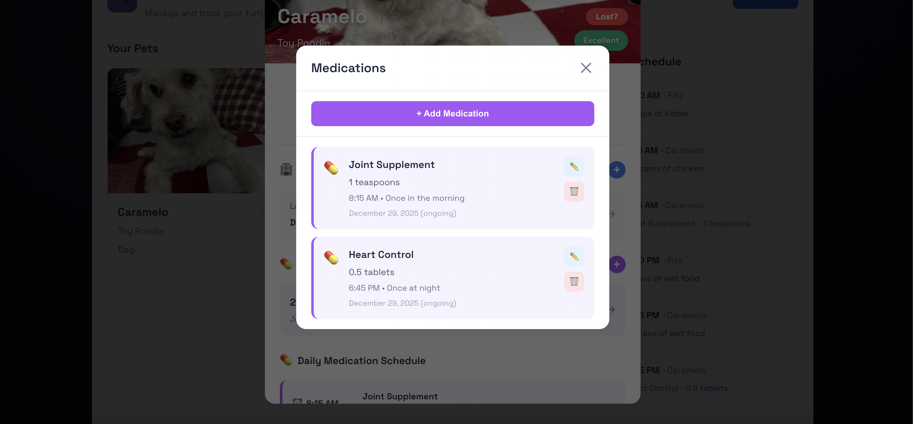
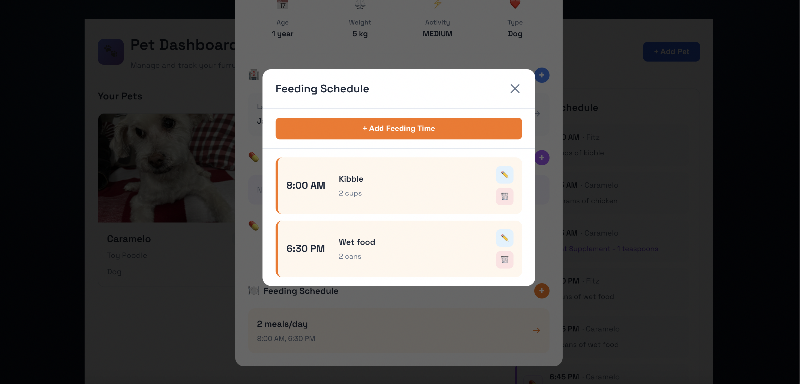
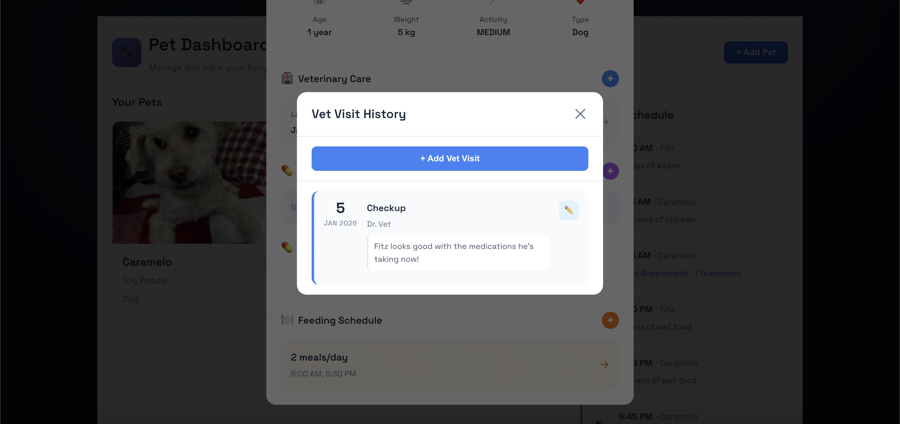

# PetTrackr 🐾

A comprehensive full-stack pet management application that helps pet owners track their pets' health, medications, feeding schedules, and veterinary appointments. Built with Spring Boot and React to demonstrate modern web development practices with emphasis on file handling and QR code generation.

# Why?

As a pet owner, I've witnessed the stress of managing multiple, or even one, pets' health. Medications get forgotten, vet appointments slip through the cracks, and feeding schedules become inconsistent. I built PetTrackr to solve these issues, and to give pet parents a centralized place to manage everything their pets need, so they can focus on what matters: keeping their furry friends healthy, happy, and taken care of.

# Learning Outcomes through PetTrackr

### Spring Boot Entity Relationships and Dependencies
Building the Owner → Pet → VetVisits/Medications/FeedingSchedules hierarchy taught me how to properly structure unidirectional JPA relationships, meaning that the annotation lives only in the parent entity. I also learned the difference in when to use `@OneToMany` vs `@ManyToOne`, how cascade behavior works, and why relationship design matters for data integrity. A key insight: making VetVisits immutable (only allowing edits to notes and nextVisitDate) demonstrated how database design enforces business rules—medical history must be trustworthy, so you protect it at the entity level, not just the UI.

### Clean REST Controller Endpoints
Designing 29 REST endpoints across 7 controllers taught me that controllers should be thin routing layers. Business logic belongs in services. By the end, all the controller endpoints are simple: `@PostMapping("/api/pets/{petId}/medications")` routes to a service that handles validation, persistence, and side effects. The payoff: endpoints are easy to read, test, and maintain. I also learned the importance of HTTP semantics—POST for creation, PATCH for partial updates, PUT for complete updates, DELETE for removal—not just CRUD endpoints, but proper REST design.

### Incremental Service Testing
Instead of writing all tests at the end, I tested services as I was building them. This helped me catch bugs early on and forced me to understand what each service actually needed to do. It also solidified the idea that ONLY services hold business logic, NOT controllers, so testing the services tend to matter the most. This practice prevented the typical end-of-project scramble and resulted in code I'm confident works.

### Frontend Callback Pattern for Real-Time Updates
The biggest learning on the React side: keeping parent and child components in sync without page reloads. When a user edits a medication in PetDetailModal, the modal needs to refresh the pet's medication list, and the dashboard needs to update its unified schedule, *all without a full page refresh*. I solved this with callbacks: child modals call `onPetUpdated()` → parent refetches data → all components re-render with fresh data. This taught me unidirectional data flow deeply—mutating data down in a child and bubbling changes back up through callbacks keeps state predictable.

# Known Limitations

- **Single Owner per Pet**: Each pet currently belongs to one owner. Future enhancement: support multiple pet parents accessing the same pet.
- **No Concurrency Handling**: When multiple users try to edit the same pet simultaneously (e.g., both editing a medication), there's no optimistic locking or conflict detection. This is a known risk if multi-user support is added.
- **No Pagination**: Dashboard and lists load all items at once. Not optimized for owners with 100+ pets.
- **Session-only Auth**: Credentials stored as HTTP-only cookies. No JWT tokens or API key support for external integrations.

# Future Enhancements and Things I'd Like to Learn

- **Deployment**: Understanding what goes into setting up a real database, how using cloud services such as AWS, and containerization tools like Docker can allow for the application to be accessed through a link rather than having to download very specific technologies in order to run the application.

- **CI/CD**: Understanding what goes into maintaining a deployed application and keeping users hooked into continuing to use the app by introducing new features and ensuring things don't break in the process of creating a new feature.

- **Multi-User Sharing**: Enhance PetTrackr to allow multiple pet parents to access the same pet. This requires solving the concurrency challenge—ensuring they don't accidentally break the application when performing the same action (like editing a Medication) at the same time. 


## Table of Contents
- [Overview](#overview)
- [Demo](#demo)
- [Screenshots](#screenshots)
- [Features](#features)
- [Tech Stack](#tech-stack)
- [Architecture](#architecture)
- [Getting Started](#getting-started)
- [API Documentation](#api-documentation)
- [Project Structure](#project-structure)
- [Development Notes](#development-notes)

## Overview

PetTrackr is a full-stack pet management platform that consolidates all essential pet health information in one place. Pet owners can manage multiple pets, track veterinary visits, schedule medications and feedings, upload photos, and generate QR codes for lost-pet flyers.

### Core Use Cases
- **Manage multiple pets** per owner with individual profiles
- **Track veterinary visits** with immutable history and next-visit reminders
- **Schedule medications** with dosage, frequency, and time tracking
- **Manage feeding schedules** organized by time of day
- **Generate QR codes** for a guide on what to do if you lost your pet
- **Upload pet photos** with automatic cache-busting for real-time updates

## Demo

Follow this link for a video demo: https://youtu.be/WNb3QTwiQfQ

## Screenshots

### Pet Dashboard
Dashboard view with pet cards and unified schedule sidebar showing feeding and medication times across all pets.


### Individual Pet Card
Quick overview of a single pet showing name, breed, age, type, and health status.



### Pet Detail View
Comprehensive pet detail modal with vet visits, medications, feeding schedules, and edit capabilities.



### Lost Pet QR Code
Emergency QR code for publicly available information on what to do when your pet is lost.


### View/Edit/Delete Medication
Functionality to view added Medications, edit them, or delete them.



### View/Edit/Delete Feeding Schedules
Functionality to view added Feeding Schedules, edit them, or delete them.




### View/Edit Vet Visits
Vet Visits are unable to be deleted, and only the notes and next visit fields are mutable, to ensure proper medical history for any given pet.



## Features

### Pet Management
- Store pet profiles with breed, type, weight, activity level, and photos
- Real-time image cache-busting ensures fresh photos after updates
- Display calculated pet age from date of birth

### Veterinary Tracking
- Log vet visits with date, veterinarian name, reason, and visit notes
- Track next scheduled visit date
- View visit count and health status
- Edit visit notes (immutable visit details protect data integrity)

### Medication Management
- Add medications with dosage, unit, frequency, and time to administer
- Set start and optional end dates for medication courses
- Edit or delete medications
- View all medications in pet detail view

### Feeding Schedules
- Create feeding times with food type, quantity, and unit
- Edit or delete feeding schedules
- View all meals in pet detail view

### Dashboard
- Unified schedule showing all feeding (🍽️ orange) and medication (💊 purple) items across all pets
- Sorted by time for easy scanning
- Color-coded visual distinction for quick identification
- Real-time refresh when changes are made from pet detail modal

### Lost Pet QR Codes
- Generate QR codes for emergency identification cards
- Public read-only access to pet info when scanned
- Download QR codes as PNG files

## Tech Stack

**Frontend:**
- React 19 with Vite build tool
- Axios for HTTP requests
- Vanilla CSS with responsive design
- React Hooks for state management (useState, useEffect)
- Context API for authentication

**Backend:**
- Java 17
- Spring Boot 4.0.1
- Spring Data JPA
- Hibernate ORM
- H2 database (development); PostgreSQL/MySQL compatible
- JUnit & Mockito for testing

### Why Spring Boot + React?

**Spring Boot**
- Relational domain (Owner → Pets → Vet Visits/Medications/Feeding) maps cleanly to JPA/Hibernate; avoids manual SQL joins.
- REST-first framework: `@GetMapping/@PostMapping/@PatchMapping/@DeleteMapping` made CRUD endpoints concise and consistent.
- Built-in file handling for pet images (MultipartFile + static resource serving) and session-based auth via Spring Security.
- Easy environment switching: H2 for local dev, Postgres/MySQL ready with minimal config changes.

**React (with Vite)**
- Unidirectional data flow keeps dashboard, modals, and panels in sync (child modals call parent callbacks → parent refetches → UI updates everywhere).
- Component reuse across similar patterns (add/edit/delete for medications, feeding schedules, vet visits) reduces duplication and bugs.
- Conditional rendering makes the unified schedule clear (orange feeding vs purple meds, different icons/text per type).
- Fast local DX with Vite + modern React hooks (useState/useEffect) and Context API for auth.

**Why this pairing helps the project**
- Backend cleanly models the relational data and serves REST/JSON plus static assets (images, QR codes).
- Frontend delivers responsive, real-time UX without page reloads, with predictable state updates.
- Both stacks are industry-standard, making the project easier to maintain, learn from, and discuss in interviews.


## Architecture

### Frontend Architecture
- **Single Page Application** built with React + Vite
- **Component-based:** Modular React components for modals, panels, cards
- **State management:** React hooks (useState, useEffect) + Context API for auth
- **API client:** Centralized Axios instance with session credentials
- **Cache-busting:** Query parameters on image URLs to force refresh after updates

### Backend Architecture
- **REST API:** Spring Boot controllers exposing CRUD endpoints
- **Data access:** Spring Data JPA repositories with custom queries
- **Entity relationships:** JPA mappings for Owner → Pets → Vet Visits, Medications, Feeding Schedules
- **File handling:** Server-side image storage in `/uploads/pet-images/`
- **Auth:** Session-based authentication with credential cookies

### Data Flow
1. Frontend sends HTTP request (GET/POST/PATCH/DELETE) with session credentials
2. Backend validates request and performs operation on H2/database
3. Backend returns JSON response or file (e.g., QR code PNG)
4. Frontend updates component state or triggers parent callback to refresh
5. Dashboard or detail modal re-renders with new data

## Getting Started

### Prerequisites
- **Java 17+** (verify with `java -version`)
- **Node.js 18+** and npm (verify with `node -v` and `npm -v`)
- **Maven Wrapper** (included in project) or Maven 3.9+

### Installation

#### Backend Setup
If on Windows:
```bash
cd PetTrackr
./mvnw clean install
./mvnw spring-boot:run
```

If on MacOS:
```bash
cd PetTrackr
mvn clean install
mvn spring-boot:run
```

Backend starts at `http://localhost:8080`. Check logs for startup messages.

#### Frontend Setup
```bash
cd PetTrackr/pettrackr-frontend
npm install
npm run dev
```
Frontend starts at `http://localhost:5173`. It proxies API calls to `http://localhost:8080/api` by default.

### Environment Variables
- `VITE_API_BASE` (optional, default: `http://localhost:8080/api`)
  Set in `.env` file in `pettrackr-frontend/` if using different backend URL

## API Documentation

### Base URL
`http://localhost:8080/api`

### Authentication
- Session-based (credentials sent in requests)
- Endpoints require user to be logged in

### Key Endpoints

**Owners:**
- `POST /auth/login` — Log in
- `POST /auth/logout` — Log out
- `GET /auth/me` — Get current user
- `POST /owners/register` — Register new owner
- `DELETE /owners/{ownerId}` - Deletes an owner

**Pets:**
- `GET /owners/{ownerId}/pets` — List all pets
- `GET /owners/{ownerId}/pets/{petId}` — Get pet details
- `POST /owners/{ownerId}/pets` — Create pet
- `PATCH /owners/{ownerId}/pets/{petId}` — Update pet
- `DELETE /owners/{ownerId}/pets/{petId}` — Delete pet

**Vet Visits:**
- `GET /owners/{ownerId}/pets/{petId}/vet-visits` — List visits
- `POST /owners/{ownerId}/pets/{petId}/vet-visits` — Add visit
- `PATCH /owners/{ownerId}/pets/{petId}/vet-visits/{visitId}` — Edit visit (notes only)
- `GET /owners/{ownerId}/pets/{petId}/qr-code` — Generate QR code PNG

**Medications:**
- `GET /owners/{ownerId}/pets/{petId}/medications` — List medications
- `POST /owners/{ownerId}/pets/{petId}/medications` — Add medication
- `PATCH /owners/{ownerId}/pets/{petId}/medications/{medicationId}` — Edit medication
- `DELETE /owners/{ownerId}/pets/{petId}/medications/{medicationId}` — Delete medication

**Feeding Schedules:**
- `GET /owners/{ownerId}/pets/{petId}/feeding-schedules` — List schedules
- `POST /owners/{ownerId}/pets/{petId}/feeding-schedules` — Add schedule
- `PATCH /owners/{ownerId}/pets/{petId}/feeding-schedules/{scheduleId}` — Edit schedule
- `DELETE /owners/{ownerId}/pets/{petId}/feeding-schedules/{scheduleId}` — Delete schedule

### Response Format
All endpoints return JSON. Example:
```json
{
  "id": 1,
  "name": "Buddy",
  "type": "Dog",
  "breed": "Golden Retriever",
  "photoURL": "buddy.jpg"
}
```

## Project Structure

```
PetTrackr/
├── PetTrackr/                          # Spring Boot backend
│   ├── src/main/java/com/PetTrackr/
│   │   ├── controller/                 # REST endpoints
│   │   ├── entity/                     # JPA entities
│   │   ├── repository/                 # Data access
│   │   ├── service/                    # Business logic
│   │   └── PetTrackrApplication.java   # Main class
│   ├── src/test/java/                  # JUnit tests
│   ├── pom.xml                         # Maven dependencies
│   └── mvnw / mvnw.cmd                 # Maven wrapper
│
├── PetTrackr/pettrackr-frontend/       # React + Vite frontend
│   ├── src/
│   │   ├── pages/                      # Page components (Home, Login)
│   │   ├── components/                 # Reusable components (modals, panels)
│   │   ├── context/                    # React Context (Auth)
│   │   ├── services/                   # API client (api.js)
│   │   └── main.jsx                    # Entry point
│   ├── public/                         # Static assets
│   ├── package.json                    # npm dependencies
│   ├── vite.config.js                  # Vite config
│   └── index.html                      # HTML template
│
├── docs/                                # Design documents
│   ├── domain-model.md                  # Entity relationships
│   └── use-cases.md                     # Use cases
│
└── README.md                            # This file
```

## Development Notes

### Key Design Decisions

1. **Immutable Vet Visits:** Visit date, vet name, and reason cannot be edited after creation to maintain historical integrity. Only notes and next-visit date are editable.

2. **Unified Dashboard Schedule:** Feeding schedules and medications are fetched separately and combined with a `type` field to enable color-coded rendering (orange vs. purple).

3. **Cache-Busting Images:** Pet photos use timestamp query parameters (`?v=1234567890`) to bypass browser cache after uploads, ensuring users always see the latest image.

4. **Callback-based Refresh:** Child components (modals) call parent callbacks (`onPetUpdated`) to trigger dashboard refresh, keeping parent and child data in sync.

5. **Session-based Auth:** Uses HTTP-only cookies to maintain login state across requests; credentials sent automatically.

### Test Coverage

**Overall Coverage:** 74% branch coverage across the entire application

**Service Layer:** 97% branch coverage (236/242 branches) — the business logic layer where core functionality lives is comprehensively tested with JUnit and Mockito.

**Coverage Breakdown by Package:**
- **Services** (business logic): 97% branch coverage: all core functionality thoroughly tested
- **Config** (Spring configuration): 88% instruction coverage
- **Entities** (JPA models): 75% instruction coverage
- **Controllers** (REST endpoints): 0% branch coverage — integration tests not implemented for this project.

The service layer's 97% coverage demonstrates that the application's critical business logic—pet management, medication tracking, vet visit scheduling, and feeding schedules—is thoroughly tested and reliable. The lower overall percentage reflects untested controller endpoints and DTO classes, which are thin routing/data layers without complex logic.

**Key Tested Flows:**
- Pet CRUD operations with validation
- Vet visit creation with immutability enforcement
- Medication scheduling with date range validation
- Feeding schedule management
- Owner account operations (registration, profile updates, deletion)
- Authorization checks ensuring owners can only access their own data

Run `mvn test` to execute the full test suite with coverage reporting via JaCoCo.

**Frontend:**
```bash
npm run build  # Verify build succeeds
```

### Before Committing
1. Run `./mvnw clean verify` or `mvn clean verify` (backend tests + build)
2. Run `npm run build` in `pettrackr-frontend/` (frontend build)
3. Verify no console errors in browser dev tools
4. Test core flows: add pet → add vet visit → add medication → verify dashboard updates

### Common Issues

**Port 8080 already in use:**
```bash
lsof -i :8080  # Find process
kill -9 <PID>  # Kill it
```

**Frontend can't reach backend:**
- Ensure backend is running at http://localhost:8080
- Check `VITE_API_BASE` environment variable
- Clear browser cache and hard refresh (Cmd+Shift+R / Ctrl+Shift+R)

## License

This project is licensed under the MIT License. See the [LICENSE](LICENSE) file for details.

**MIT License summary:**
- You can use this project for personal and commercial purposes
- You can modify and distribute it
- You must include the original license and copyright notice
- The author provides no warranty


